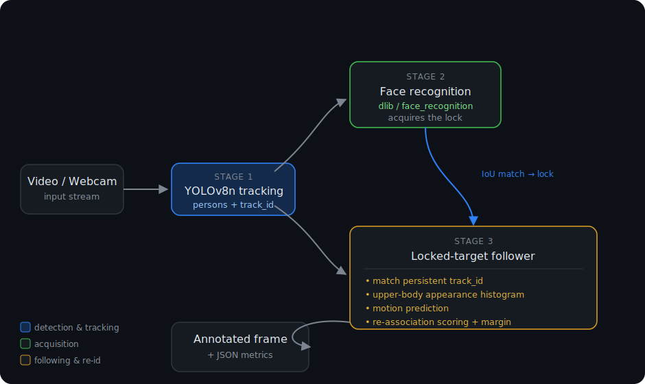

# HRTV — Human Recognition & Tracking Video

A real-time computer vision pipeline that **identifies a specific person by face, then locks onto and follows them** across a video stream — even when their face is no longer visible, when they turn around, or when they cross paths with other people.

This is the perception core of a larger goal: a drone capable of autonomously following its owner. This repository focuses on the vision side — reliably answering *"where is my target in this frame?"* on every frame.

---

## Why this project

Following a person with a camera sounds simple until you try it. A face is only recognizable for a fraction of the time — the subject turns away, walks into shadow, or is partially hidden. A naive face-recognition loop loses the target instantly.

This project solves that by combining three complementary signals so that no single point of failure breaks tracking:

1. **Face recognition** identifies *who* the target is (used to acquire the lock).
2. **Person detection + tracking** follows the target's body once the face is no longer needed.
3. **Appearance-based re-association** recovers the target when the tracker drops or swaps its ID during crossings and occlusions.

The result is a system that stays locked on one specific person through movement, occlusion, and identity switches — with a quantitative evaluation harness to prove it.

---

## Architecture



### The three stages in detail

**1. Target acquisition — face recognition**
Known face encodings of the target are compared against faces detected in the frame. On a confident match (distance below `FACE_TOLERANCE`), the recognized face box is matched to a YOLO person box by IoU, and that person's `track_id` becomes the locked target.

**2. Target following — person tracking**
Once locked, the system follows the YOLOv8n tracker's persistent `track_id`. The face is no longer required — the target can turn around, look away, or move to the edge of the frame and still be followed.

**3. Robust re-identification — appearance + motion**
When the tracker loses or swaps the target's ID (typical during crossings and occlusions), a fallback re-associates the target using a weighted score built from:

- **Appearance similarity** — a normalized HSV color histogram of the upper body, smoothed over time with exponential blending to resist lighting changes.
- **Motion prediction** — a velocity estimate that predicts where the target should appear next.
- **Spatial consistency** — IoU with the predicted box, center distance, and bounding-box area consistency.

A minimum-margin rule rejects ambiguous cases where two people score almost equally, preventing the lock from being "stolen" by a passer-by.

---

## Repository layout

```
.
├── src/
│   ├── face_id_model.py       # Builds & enriches the target's face encodings
│   └── lock_and_track.py      # Main real-time lock + track pipeline
├── create_dataset_face.py     # Quick script to generate base face encodings
├── models/
│   └── yolov8n.pt             # YOLOv8 nano weights (person detection)
├── dataset/                   # Person-detection dataset (YOLO format)
│   ├── images/{train,val}/    # 80 train / 21 val images
│   └── labels/{train,val}/
├── dataset_faces/youri/       # 44 face images used to build the target encodings
├── tests/
│   ├── test_video_eval.py     # Pytest suite over video scenarios
│   ├── video_eval_runner.py   # Runs the tracker on videos and checks thresholds
│   ├── video_scenarios.json   # Scenario definitions + success criteria
│   └── reports/               # Generated JSON metrics per scenario
└── youri_encodings*.pkl       # Serialized target face encodings
```

---

## How it works — key design choices

- **YOLOv8n (nano)** is chosen deliberately: it is lightweight enough to be a realistic target for embedded / on-drone inference, while still providing strong person detection with built-in multi-object tracking.
- **Face recognition is used only to acquire the lock**, not to sustain it. This is what allows tracking to survive when the face is hidden or turned away.
- **Appearance re-identification runs only when needed** (after an ID loss during occlusion), keeping the common case fast.
- **Exponential smoothing of the target's appearance histogram** keeps the identity stable across small lighting and pose variations rather than reacting to every frame.
- **A dedicated evaluation harness** turns "it seems to work" into measurable success criteria (lock ratio, times lock lost, occlusion frames, and more).

---

## Installation

Requires **Python 3.10**.

```bash
# Clone
git clone <your-repo-url>
cd HRTV

# Create a virtual environment
python -m venv venv
source venv/bin/activate        # Windows: venv\Scripts\activate

# Install dependencies
pip install ultralytics face_recognition opencv-python numpy dlib torch pytest
```

> **Note:** `face_recognition` depends on `dlib`, which needs CMake and a C++ build toolchain. On Windows, installing a prebuilt `dlib` wheel is the smoothest path.

---

## Usage

### 1. Build the target's face encodings

Generate the base encodings from a folder of the target's face images:

```bash
python create_dataset_face.py
```

Then enrich them — this recovers faces the standard pass misses by retrying with upsampling, rescaling, rotation, and contrast enhancement (CLAHE):

```bash
python src/face_id_model.py
```

This produces `youri_encodings_enriched.pkl`, the encoding set used at runtime.

### 2. Run lock & track

**On a webcam:**

```bash
python src/lock_and_track.py
```

**On a video file, saving the annotated output and a metrics report:**

```bash
python src/lock_and_track.py \
  --video path/to/video.mp4 \
  --output annotated.mp4 \
  --metrics-output report.json
```

**Headless (no display window), useful for automated evaluation:**

```bash
python src/lock_and_track.py --video path/to/video.mp4 --headless --max-frames 600
```

Press `q` or `Esc` to quit the live window.

#### Command-line options

| Flag | Description |
|------|-------------|
| `--video` | Path to a video file. Omit to use the webcam. |
| `--output` | Save the annotated output video. |
| `--metrics-output` | Save a JSON evaluation report. |
| `--headless` | Disable the OpenCV preview window. |
| `--max-frames` | Limit the number of processed frames. |
| `--display-max-width` / `--display-max-height` | Preview window size limits. |

---

## Evaluation

The tracker writes a JSON report for every run so performance can be measured, not guessed. Reported metrics include:

| Metric | Meaning |
|--------|---------|
| `lock_acquired` | Whether the target was ever locked |
| `lock_frame` | First frame where the lock was acquired |
| `lock_ratio` | Fraction of frames the tracker stayed locked |
| `target_visibility_ratio` | Fraction of frames the target track was found |
| `times_lock_lost` | Number of full unlocks |
| `max_consecutive_lost_frames` | Longest temporary-loss streak |
| `occlusion_frames` | Frames spent handling an occlusion |
| `reassociation_successes` | Successful ID recoveries after loss |
| `ended_locked` | Whether the tracker was still locked at the end |

### Running the test suite

Scenarios and their success thresholds are defined in `tests/video_scenarios.json`. Copy the example to get started:

```bash
cp tests/video_scenarios.example.json tests/video_scenarios.json
# edit it to point at your own videos and thresholds
```

Then run the suite:

```bash
pytest tests/test_video_eval.py -s
```

Run a single scenario:

```bash
pytest tests/test_video_eval.py -s -k static_youri_front_webcam
```

**Baseline result** — on a static, front-facing, single-person video (618 frames, CPU):

```json
{
  "frames_processed": 618,
  "lock_acquired": true,
  "lock_frame": 1,
  "times_lock_lost": 0,
  "lock_ratio": 1.0,
  "target_visibility_ratio": 1.0,
  "ended_locked": true
}
```

The lock is acquired on the first frame and held for 100% of the video, with zero losses.

---

## Tech stack

| Component | Technology |
|-----------|-----------|
| Person detection & tracking | Ultralytics YOLOv8n |
| Face recognition | `face_recognition` (dlib) |
| Image processing | OpenCV, NumPy |
| Deep-learning backend | PyTorch |
| Testing | Pytest |
| Language | Python 3.10 |

---

## Roadmap

This vision pipeline is the first milestone toward an autonomous person-following drone. Planned directions:

- Extend the evaluation set with harder scenarios (crossings, target leaving and re-entering the frame, back-facing views).
- Estimate the target's relative position and scale in the frame to drive flight control — keeping the target centered and at constant size becomes the control loop.
- Explore a learned re-identification embedding for tougher appearance conditions.
- Optimize for real-time throughput on embedded hardware.

---

## License

This project is licensed under the GNU Affero General Public License v3.0 (AGPL-3.0), consistent with its Ultralytics YOLOv8 dependency.
